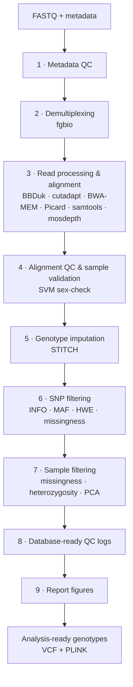

# read2geno

A genotyping-by-imputation pipeline that turns low-coverage, short-read whole-genome sequencing into quality-controlled, imputed genotype calls for outbred [Heterogeneous Stock (HS) rats](https://ratgenes.org/). It runs on a SLURM-managed HPC and currently imputes ~11,000,000 SNPs across ~30,000 samples (and growing!).  fanning work out across per-sample and per-chromosome array jobs.

## Data engineering highlights

- **Parallelised by chromosome.** STITCH can emit terabytes of imputed genotype data, and genome-wide imputation exhausted available RAM and triggered out-of-memory failures. Imputation now runs on chromosome chunks and downstream PLINK analyses run per chromosome, so each job processes a fraction of the genome and stays within its memory allocation as the sample population grows.
- **Fault-tolerant array jobs.** Because of the scale it runs at, many stages are split across SLURM array tasks. Each stage has a dedicated *check* step that inspects array outputs and builds a *re-run* manifest containing only the incomplete tasks, so individual failures can be reprocessed without re-running the whole stage.
- **Machine-learning sample validation.** A linear SVM predicts genetic sex from chrX/chrY read-depth and cross-checks it against the recorded sex in metadata, flagging mislabelled samples before they reach imputation.

## Data Engineering Highlights

- Due to the scale at which this pipeline is run, a number of steps are split across SLURM array tasks. The pipeline was rebuilt to be **fault-tolerant** and hasdedicated *check* steps to inspect these arrays and generate *re-run* manifests containing only incomplete tasks, so specific array failures are easy to rerun and doesn't require a full rerun. 
- STITCH can emit terabytes of imputed genotype data and genome-wide imputation exhausted available RAM and triggered out-of-memory job failures. As such, to scale with our ever-growing sample population, imputation is now **parallelised** so that STITCH runs on chromosome chunks and downstream PLINK analyses runs per chromosome.
- HS rat sample identity is verified using a **machine-learning** model. A linear SVM predicts genetic sex from chrX/chrY read-depth and cross-checks it against recorded sex in the metadata to flag mislabelled samples before they undergo imputation.

This is an internal lab pipeline: input metadata and sequencing data are produced in-house by the lab's sequencing protocols and database systems, so the repository ships without a bundled tutorial dataset. Configuration is fully templated, so the pipeline can be retargeted to other clusters, reference genomes, and cohorts.

## Pipeline architecture



Each numbered stage is an independently runnable step (`python pipeline.py --step N`). "Check" sub-steps inspect the outputs of parallelised array jobs and rebuild a re-run list of only the tasks that failed or did not complete, so partial failures are cheap and easy to recover from.

**Input:** Illumina paired-end reads (FASTQ), a sample metadata sheet, a reference genome (FASTA), a SNP positions file, and a haplotype reference panel.
**Output:** Imputed, filtered genotypes in **VCF** and **PLINK 2** (`.pgen/.pvar/.psam`), SNP and sample QC metrics, report figures, and database-ready QC logs.

## Pipeline stages

| Step | Stage | Key tools | Output |
|------|-------|-----------|--------|
| 1 | **Metadata QC** — validate and clean the sample sheet; check sample IDs, FASTQ paths, and library associations; generate demultiplexing inputs and demographic summaries | pandas, plotly | Cleaned metadata, demux inputs, demographic figures |
| 2 | **Demultiplexing** — split library-level FASTQs into per-sample FASTQs using read structures | fgbio `DemuxFastqs` | Sample-level FASTQs + metrics |
| 3 | **Read processing & alignment** — adapter/quality trimming, alignment to reference, duplicate marking, and alignment QC | BBDuk, cutadapt, FastQC, BWA-MEM, samtools, Picard, mosdepth | Sorted, duplicate marked BAMs + QC metrics |
| 4 | **Alignment QC & sample validation** — aggregate alignment metrics; validate samples via an SVM sex-check against recorded metadata; assemble STITCH inputs | scikit-learn, plotly | QC plots, validated sample lists, STITCH inputs |
| 5 | **Genotype imputation** — low-coverage imputation across chromosome chunks in parallel | STITCH (R) | chromosome chunk VCFs |
| 6 | **SNP filtering** — flag variants failing imputation INFO score, missingness, MAF, or Hardy–Weinberg thresholds | PLINK 2, bcftools | Filtered variant set |
| 7 | **Sample filtering** — flag samples failing missingness, heterozygosity; detect population-structure outliers via Mahalanobis distance on PCs | PLINK 2, NumPy | Filtered sample set |
| 8 | **Database-ready logs** — produce QC logs for ingestion into the in-house database | pandas | Schema-conforming QC tables |
| 9 | **Report figures** — generate reporting figures from aggregated QC files | plotly | Report-ready plots |

## Tech stack

- **Languages:** Python, Bash, R
- **Scheduling and Infra:** SLURM, conda
- **(Main) Python pkgs:** pandas, NumPy, scikit-learn, plotly
- **Bioinformatic pkgs:** BWA, samtools, bcftools, Picard, fgbio, BBMap (BBDuk), cutadapt, FastQC, mosdepth, PLINK 1.9 / PLINK 2, STITCH

## Configuration

All run-specific settings live in `user/` — the pipeline logic itself contains no hard-coded paths:

- **`user/user_args.txt`** — HPC/SLURM parameters (allocation, partition, QOS, CPUs, conda environments), project directories, reference genome, STITCH inputs, and QC thresholds (INFO score, MAF error rate, missingness).
- **`user/software_location.txt`** — paths to external tool binaries/JARs, edited once per system.

## Running the pipeline

```bash
# 1. Set up a working directory and clone the pipeline into it
# 2. Edit user/user_args.txt and user/software_location.txt for your system
# 3. Run each stage in order (each submits SLURM jobs):
python pipeline.py --step 1     # Metadata QC
python pipeline.py --step 2     # Demultiplexing
python pipeline.py --step 3     # Read processing & alignment
python pipeline.py --step 4     # Alignment QC & sample validation
python pipeline.py --step 5     # Imputation (STITCH)
python pipeline.py --step 6     # SNP filtering
python pipeline.py --step 7     # Sample filtering
python pipeline.py --step 8     # Database-ready QC logs
python pipeline.py --step 9     # Report figures
```
Re-running a step detects completed work and reprocesses only the tasks that need it.

## Requirements

- A SLURM-managed HPC cluster
- Python and R, managed via conda environments
- The external bioinformatics tools listed under [Tech stack](#tech-stack)
- A reference genome
- A SNP positions file and haplotype reference panel for STITCH imputation

## Author & acknowledgements

Developed at the Palmer Lab, UC San Diego, by [@gavrila-ang](https://github.com/gavrila-ang), [@Ben Johnson](https://github.com/bbjohnson6810), and [@Denghui Chen](https://github.com/Deeeeen). Builds on [STITCH](https://github.com/rwdavies/STITCH) for low-coverage genotype imputation, alongside the open-source bioinformatics tools listed above.


